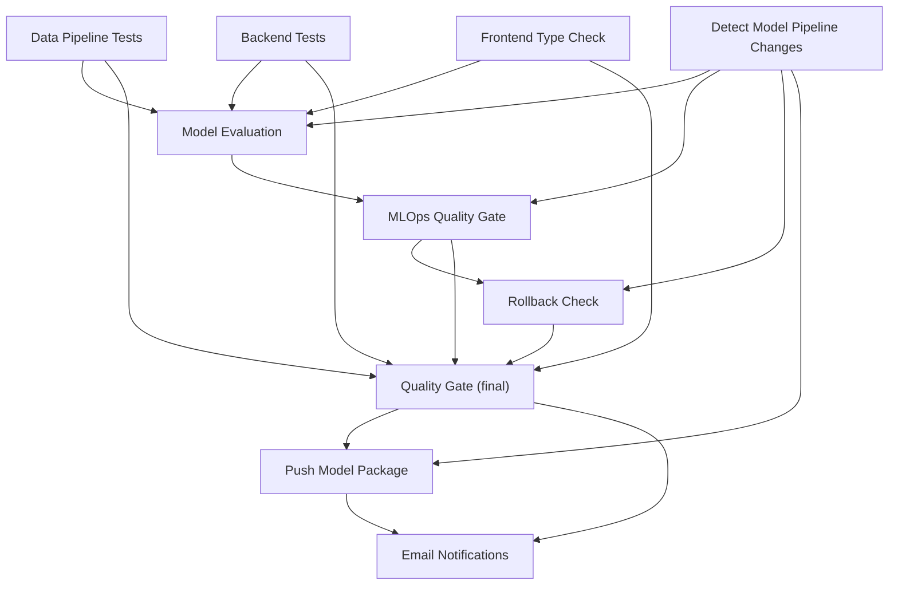

# CI/CD Pipeline

This document covers the CI/CD setup for the Iikshana courtroom accessibility project. It explains what the pipeline does, how it is structured, what each job checks, and how it ties back to the project requirements described in `Model_pipeline.pdf`.

## When does the pipeline run?

The CI workflow (`ci.yml`) runs on every push to any branch and on pull requests targeting `main`. It covers testing, model evaluation, quality gates, and rollback safety.

The deploy workflows (`deploy-backend.yml`, `deploy-frontend.yml`) only trigger after the CI workflow completes successfully on `main`. This means nothing gets deployed unless all checks pass first.

## Pipeline overview

The CI workflow has 10 jobs. Some run in parallel, some depend on earlier jobs finishing first. Here is the dependency flow:

## Job by job

### 1. Detect Model Pipeline Changes

This job uses `dorny/paths-filter` to check if the current commit touches any model related files. It looks at paths like `model-pipeline/**`, `config/models/**`, `scripts/**`, and a couple of backend service files. The result (`model_changed: true/false`) is passed to downstream jobs so they can skip model evaluation when nothing relevant changed. This avoids burning API credits on unrelated commits.

### 2. Data Pipeline Tests

Runs `pytest` on the `data-pipeline/tests/` directory with coverage reporting. It installs only the packages the data pipeline needs (numpy, scipy, pandas, fairlearn, etc.) and skips tests that require external API calls or large dataset downloads. The coverage report is uploaded as a workflow artifact.

### 3. Backend Tests

Same pattern as the data pipeline tests but for `backend/tests/`. Installs FastAPI, websockets, and related packages, then runs pytest with coverage. This catches regressions in the API layer, agent orchestration, and service modules.

### 4. Frontend Type Check

Sets up Node.js 18, installs dependencies, and runs `npx tsc --noEmit --skipLibCheck`. This is a strict TypeScript type check that fails the pipeline if there are type errors in the React frontend. It also verifies the source directory structure exists.

### 5. Model Evaluation

This is the most involved job. It only runs when model related files changed (based on the output of Job 1), and it waits for all three test jobs to pass first.

What it does:

1. **Generates evaluation inputs** from `data/court_phrases.csv` using `build_translation_inputs_from_court_phrases.py`. This file is committed to the repo, so CI does not need access to private datasets or DVC.
2. **Runs validation** (`run_validation.py`) on a 20 row sample using the Groq API. Produces `validation_metrics.json` with BLEU, chrF, and exact match scores.
3. **Runs bias detection** (`run_model_bias_detection.py`) to check for performance disparities across groups (dataset, emotion).
4. **Runs config search** (`run_config_search.py`) comparing two configurations (`translation_flash_v1` and `translation_flash_glossary`) to find which one scores higher on BLEU.

All output files are uploaded as the `model-evaluation-artifacts` artifact so downstream jobs can access them.

### 6. MLOps Quality Gate

Downloads the evaluation artifacts from Job 5 and runs three gate scripts:

| Gate | Script | What it checks | Current threshold |
|------|--------|----------------|-------------------|
| Quality gate | `scripts/quality_gate.py` | BLEU, chrF, exact match against minimums | BLEU >= 1.0, chrF >= 5.0, exact match >= 0.0 |
| Bias gate | `scripts/bias_gate.py` | Number of detected disparities | <= 2 disparities allowed |
| Config search gate | `scripts/config_search_gate.py` | Whether the best config meets the BLEU target | BLEU target >= 1.0 |

If any gate script exits with code 1, the job fails and blocks everything downstream.

When no model files changed, this job skips the gates and passes through.

### 7. Rollback Check

Downloads the same evaluation artifacts and compares current metrics against `data/baseline_metrics.json`, which is committed to the repo. If BLEU, chrF, or exact match scores drop below the baseline, the pipeline fails. This prevents deploying a model that performs worse than what we already have.

The rollback check script is at `scripts/rollback_check.py`.

### 8. Quality Gate (final)

This is a lightweight aggregation job. It depends on all five upstream jobs (data pipeline tests, backend tests, frontend type check, MLOps quality gate, and rollback check). If any of them failed, this job fails too. If they all passed, it prints a success message. Downstream jobs like deployment and notifications depend on this single gate.

### 9. Push Model Package (main only)

Only runs on the `main` branch and only when model files changed. After the final quality gate passes, it:

1. Authenticates to Google Cloud using a service account key.
2. Builds a model package tarball with `build_model_package.py`.
3. Pushes the tarball to a GCP Artifact Registry generic repository (`model-packages`).

This is how validated model configurations get versioned and stored.

### 10. Email Notifications

Two notification jobs handle success and failure:

- **Notify Failure**: sends an email if any required job failed. Includes the repository, branch, commit SHA, actor, and a direct link to the failed run.
- **Notify Success**: sends an email if everything passed.

Both use SMTP credentials stored in GitHub Secrets.

## Deploy workflows

These are separate workflow files that trigger after CI succeeds on `main`:

**`deploy-backend.yml`**: Builds a Docker image from `backend/Dockerfile`, tags it with the commit SHA and `latest`, and pushes both tags to GCP Artifact Registry (Docker format). It also re-runs backend tests as a final safety check before pushing.

**`deploy-frontend.yml`**: Installs dependencies, lints, builds the React app, and uploads the production build as a workflow artifact tagged with the commit SHA.

Both workflows have an `if: success()` guard that only lets them run when the CI workflow completed successfully. They will never trigger on a failed CI run.

## Required GitHub Secrets

These secrets must be configured in the repository settings under Settings > Secrets and variables > Actions:

| Secret | Purpose |
|--------|---------|
| `GROQ_API_KEY` | API key for the Groq inference API, used during model evaluation |
| `GCP_SA_KEY` | Google Cloud service account key JSON, used for Artifact Registry auth |
| `GCP_PROJECT_ID` | GCP project ID (e.g., `my-project-123456`) |
| `ARTIFACT_REGISTRY_LOCATION` | GCP region for Artifact Registry (e.g., `us-central1`) |
| `ARTIFACT_REGISTRY_REPO` | Name of the Docker format Artifact Registry repository |
| `SMTP_SERVER` | SMTP server address for email notifications (e.g., `smtp.gmail.com`) |
| `SMTP_PORT` | SMTP port (e.g., `465` for SSL) |
| `SMTP_USERNAME` | SMTP login email address |
| `SMTP_PASSWORD` | SMTP password or app password |
| `NOTIFICATION_EMAIL` | Email address that receives CI notifications |

## How this aligns with the project requirements

The `Model_pipeline.pdf` describes requirements for automated model evaluation, quality enforcement, and deployment. Here is how the pipeline maps to those requirements:

**Automated testing**: Every push runs unit tests for the data pipeline, backend, and frontend. No code reaches `main` without passing all three test suites.

**Model evaluation with metrics**: When model related files change, CI automatically runs validation and computes BLEU, chrF, and exact match accuracy. These are the same metrics described in the proposal for translation quality.

**Bias detection**: The pipeline runs `run_model_bias_detection.py` to flag performance disparities across demographic groups. The bias gate enforces a maximum disparity count before allowing the pipeline to proceed.

**Configuration comparison**: `run_config_search.py` compares multiple prompt/model configurations and identifies the best performer. The config search gate ensures the winning configuration meets a minimum BLEU target.

**Rollback mechanism**: The rollback check compares current metrics against a committed baseline file. If a new change causes metric regression, the pipeline blocks it. This is the "rollback guard" described in the requirements.

**Conditional execution**: Model evaluation jobs only run when model related files are touched. This saves API costs and CI minutes on commits that only affect the frontend or documentation.

**Artifact management**: Evaluation outputs (metrics JSON, bias reports, plots) are uploaded as GitHub Actions artifacts. On `main`, validated model packages are pushed to GCP Artifact Registry for versioned storage.

**Deployment gating**: Deploy workflows only trigger after CI passes on `main`. The backend Docker image and frontend build are never published from a failing pipeline.

**Notifications**: Email alerts go out on both success and failure, so the team knows the state of every CI run without checking GitHub manually.

## Adjusting thresholds

As the model improves, you should raise the quality gate thresholds to match. Here is where each threshold lives:

| What to change | File | Variable |
|----------------|------|----------|
| BLEU minimum | `scripts/quality_gate.py` | `BLEU_MIN` |
| chrF minimum | `scripts/quality_gate.py` | `CHRF_MIN` |
| Exact match minimum | `scripts/quality_gate.py` | `EXACT_MATCH_MIN` |
| Max allowed bias disparities | `scripts/bias_gate.py` | `MAX_DISPARITIES` |
| Config search BLEU target | `model-pipeline/scripts/run_config_search.py` | `PROPOSAL_BLEU_TARGET` |
| Rollback baseline | `data/baseline_metrics.json` | `metrics.bleu`, `metrics.chrf`, `metrics.exact_match_accuracy` |

The current thresholds are set conservatively for CI smoke testing on a small 20 row sample. Once you have confidence in the model's production performance, raise these to match your actual quality targets.
