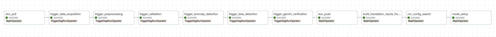

# Model Pipeline

This directory is the **model-development** layer: translation and evaluation on top of **`data/processed/<split>/`** (manifests, WAVs, etc.) produced by the data pipeline.

**What we optimize:** we do **not** train neural weights. The “model” is a **fixed API** (e.g. Groq `llama-3.1-8b-instant`) plus **YAML configuration** (prompts, `temperature`, `top_p`, `max_output_tokens`) and optional Speech-to-Text for audio-derived sources. Work is **config-driven**: `config/models/*.yaml` + `prompts/*.txt` + `backend/src/services/gemini_translation.py` (`translate_text` routes to Groq, Hugging Face, etc. per config).

**Where outputs go:** by default, pipeline inputs are read from **`data/processed/`** and model artifacts from **`data/model_runs/<split>/`**. Scripts resolve CSV/JSON in **model_runs first**, then **processed** (see `model_pipeline_paths.py`). Legacy **`--data-dir`** sets one root for both. Optional env: **`PIPELINE_DATA_DIR`**, **`MODEL_OUTPUT_ROOT`**.

---

## 1. Overview

| Component                                        | Role                                                                                                                                                                                         |
| ------------------------------------------------ | -------------------------------------------------------------------------------------------------------------------------------------------------------------------------------------------- |
| **`config/models/*.yaml`**                       | `id`, `provider` (e.g. `groq`), `model_name`, `system_prompt_id` / `prompt_template_id`, decoding params.                                                                                    |
| **`prompts/*.txt`**                              | Prompt bodies; placeholders filled by `translate_text`.                                                                                                                                      |
| **`backend/src/services/gemini_translation.py`** | Loads YAML + prompts; **`translate_text(...)`** calls the provider. Optional kwargs **`temperature`**, **`top_p`**, **`max_output_tokens`** override YAML for sweeps (sensitivity analysis). |
| **`backend/src/services/elevenlabs_stt_service.py`** | ElevenLabs **Scribe v2** STT for **`build_translation_inputs_from_audio.py`** and related scripts (`ELEVENLABS_API_KEY`).                                                             |
| **`model-pipeline/scripts/*.py`**                | Build eval tables, search configs, validate, sensitivity, bias, package, push.                                                                                                               |

### Translation configs compared (multi-provider)

These YAMLs live under **`config/models/`**. They extend the original Groq “flash” prompt variants with **Google Gemini**, **Groq Llama 3.3 70B**, and **Hugging Face** Marian NMT for side-by-side evaluation (`run_config_search.py`). **Secrets:** `GEMINI_API_KEY` (Gemini), `GROQ_API_KEY` (Groq), `HF_API_TOKEN` (Hugging Face Inference API).

| Config ID | Provider | Model | Parameters | Type |
| --- | --- | --- | --- | --- |
| `translation_gemini_flash_compare` | Google Gemini | `gemini-2.0-flash` | Not publicly disclosed | Large multimodal LLM |
| `translation_groq_llama70b_v1` | Groq | `llama-3.3-70b-versatile` | 70B | Open-weight LLM (Meta) |
| `translation_hf_v1` | Hugging Face | `Helsinki-NLP/opus-mt-en-es` | ~77M | Marian NMT (encoder–decoder) |
| `translation_hf_opus_tc_big_v1` | Hugging Face | `Helsinki-NLP/opus-mt-tc-big-en-es` | ~230M | Marian NMT (larger variant) |

**Selected default:** On recent dev evals, **`translation_groq_llama70b_v1`** scored highest on corpus **BLEU** versus the other configs above, so it is the **operational default**: `translate_text` in `gemini_translation.py`, **`model_setup.py`**’s default `--config-id`, Airflow **`mode_setup`** (via **`best_config_id`** in `data/processed/<split>/config_search_results.json`, with param fallback), and the expanded config list in the Airflow DAGs. Re-run **`run_config_search.py`** when you add configs or change data; older **`translation_flash_*`** YAMLs remain available for prompt ablations.

**Live expo (Gradio):** [`demo/gradio_expo_app.py`](../demo/gradio_expo_app.py) — ingests via **`process_one`**, then triggers Docker Airflow **`expo_translation_dag`** by default (**build_translation_inputs → mode_setup**, fixed `config_id`; no config search). Set **`AIRFLOW_MODEL_DAG_ID=model_pipeline_dag`** for **build → config search → mode_setup**. Runbook: [`demo/README.md`](../demo/README.md).

---

## 2. Model development and ML code

### 2.1 Building evaluation tables

| Script                                               | What it does                                                                                                                                                                                                                                            | Output (default location)                                                                                                                                                            |
| ---------------------------------------------------- | ------------------------------------------------------------------------------------------------------------------------------------------------------------------------------------------------------------------------------------------------------- | ------------------------------------------------------------------------------------------------------------------------------------------------------------------------------------ |
| **`build_translation_inputs_from_audio.py`**         | Reads **`manifest.json`** + WAVs under `data/processed/<split>/`. Runs **ElevenLabs Scribe v2** STT (`--stt-model`, default `scribe_v2`). Maps **RAVDESS** files to scripted English + Spanish references. Falls back to gold script if STT fails. | **`translation_inputs.csv`** under `data/model_runs/<split>/` (columns include `source_text`, languages, `reference_translation`, often `file`, `dataset`, `speaker_id`, `emotion`). |
| **`build_translation_inputs_from_court_phrases.py`** | Reads **`data/court_phrases.csv`**                                                                                                                                                                                                                      | **`court_translation_inputs.csv`**                                                                                                                                                   |
| **`build_combined_translation_inputs.py`**           | Merges audio + court tables (optional)                                                                                                                                                                                                                  | **`combined_translation_inputs.csv`** (or similar basename)                                                                                                                          |

**Requirements:** **`ELEVENLABS_API_KEY`** for Scribe STT; **`GROQ_API_KEY`** for Groq-backed translation configs. Rate limits are possible—increase **`--delay`** between STT calls or reduce **`--max-rows`**.

### 2.2 Core scripts (what each step produces)

| Script                                                         | Purpose                                                                                                                                                             | Key artifacts                                                                        |
| -------------------------------------------------------------- | ------------------------------------------------------------------------------------------------------------------------------------------------------------------- | ------------------------------------------------------------------------------------ |
| **`run_config_search.py`**                                     | Compare many **`config_id`** values on the **same** eval CSV; metric **BLEU** or **chrF**; optional glossary enforcement vs `data/legal_glossary/legal_terms.json`. | **`config_search_results.json`** — list of per-config scores + **`best_config_id`**. |
| **`run_validation.py`**                                        | Run one or more configs; corpus metrics, plots; **MLflow** logging (§4).                                                                                            | **`validation_metrics.json`** / CSV, plots, optional MLflow run.                     |
| **`model_setup.py`**                                           | Full translation pass for a chosen **`--config-id`** (e.g. best from search); supports STT path when using manifest + WAVs.                                         | **`translation_predictions_<config_id>.csv`** (predictions for bias / reporting).    |
| **`run_sensitivity_analysis.py`**                              | Sensitivity of metrics to **decoding knobs** and **input strata** (§5).                                                                                             | **`sensitivity_analysis.json`**                                                      |
| **`run_translation_bias_analysis.py`**                         | Fairlearn **group** metrics (exact match, etc.).                                                                                                                    | **`translation_bias_metrics_<config>.json`**                                         |
| **`run_model_bias_detection.py`**                              | **Sliced** metrics, disparity vs threshold, mitigation narrative; **MLflow** scalars (`bias_*`) + report/plot artifacts (use **`--no-mlflow`** to skip).           | **`model_bias_report_<config>__<group_suffix>.json`** (+ optional PNG).              |
| **`build_model_package.py`** / **`push_model_to_registry.py`** | Tarball (config + prompts + manifest) and **GCP Artifact Registry** upload.                                                                                         | `model-pipeline/artifacts/*.tar.gz`, registry package version.                       |

### 2.3 Tests

- **`model-pipeline/tests/test_model_bias_detection_core.py`**, **`test_run_model_bias_detection_cli.py`** — bias pipeline logic and CLI.

---

## 3. Hyperparameter tuning

**Meaning here:** choosing among **discrete YAML configs** and decoding parameters, not backprop. Each file under **`config/models/`** is a candidate (e.g. `translation_flash_v1`, `translation_flash_glossary`, …, plus **`translation_gemini_flash_compare`**, **`translation_groq_llama70b_v1`**, **`translation_hf_v1`**, **`translation_hf_opus_tc_big_v1`** — see the comparison table under **Overview** above).

**Tool:** **`run_config_search.py`**

- **`--configs`** — comma-separated `config_id` list, or logic to load all YAMLs (see script `--help`).
- **`--metric`** — `bleu` or `chrf`.
- **`--inputs-basename`** — e.g. `translation_inputs`, `court_translation_inputs` (must exist under model_runs or processed for that split).
- **`--max-rows`**, **`--delay`** — cap cost and ease rate limits.

**Output:** **`config_search_results.json`** (under `data/model_runs/<split>/` by default) includes **`best_config_id`**. Downstream:

- **`model_setup.py --config-id <best_config_id>`** for a full prediction CSV.
- **`run_validation.py --config-id ...`**, **`run_model_bias_detection.py --config-id ...`** for reports on that config.

**Apache Airflow (`full_pipeline_dag`):** after **`dvc_push`**, the DAG runs **`run_config_search`** with a fixed list of config IDs (see `airflow/dags/full_pipeline_dag.py`), then **`mode_setup`** (`model_setup.py`) with **`best_config_id`** read from **`data/processed/<split>/config_search_results.json`** (Airflow writes search results under **processed** for that task; local CLI often uses **model_runs**—keep paths consistent for your environment).

```bash
export PYTHONPATH=.
export GROQ_API_KEY=...   # required for Groq configs

python model-pipeline/scripts/run_config_search.py --split dev \
  --inputs-basename court_translation_inputs \
  --configs translation_flash_v1,translation_flash_glossary \
  --metric bleu --delay 0.5

# Multi-provider comparison; write under processed for Airflow model_setup
export GEMINI_API_KEY=...   # Gemini configs
export HF_API_TOKEN=...     # Hugging Face configs
python model-pipeline/scripts/run_config_search.py --split dev \
  --configs translation_gemini_flash_compare,translation_groq_llama70b_v1,translation_hf_v1,translation_hf_opus_tc_big_v1 \
  --metric bleu --delay 0.5 \
  --output data/processed/dev/config_search_results.json
```

---

## 4. Experiment tracking and results

### 4.1 MLflow (`run_validation.py`)

When validation runs, it can log to **MLflow**:

- **Experiment name:** `iikshana-translation`
- **Tracking URI:** env **`MLFLOW_TRACKING_URI`**, or default **`file:./mlruns`** (local store under repo root)
- **Run name pattern:** `{config_id}_{split}_{inputs_basename}`
- **Logged:** params (`config_id`, `split`, `inputs_basename`, `n_samples`, …), metrics (BLEU, chrF, exact match, …), and **artifacts** (e.g. metric plots) when files exist

**Model bias detection (`run_model_bias_detection.py`):** same experiment and tracking URI. Run names look like **`bias_<config_id>_<split>_<group_suffix>`** with param **`run_type=model_bias_detection`**. Metrics include **`bias_overall_exact_match`**, **`bias_fairlearn_exact_match`**, **`bias_fairlearn_mean_sentence_bleu`** (when Fairlearn + sacrebleu run), **`bias_disparity_count`**, **`bias_max_disparity_gap`**, slice min/max exact match, and **`bias_n_samples`**. Artifacts: the JSON report under **`bias_report/`** and optional PNG under **`bias_plots/`**. Pass **`--no-mlflow`** to disable.

Use the MLflow UI against your tracking URI to compare runs over time.

### 4.2 Files on disk (usual layout: `data/model_runs/<split>/`)

| Artifact                                   | Source                        |
| ------------------------------------------ | ----------------------------- |
| `validation_metrics.json` / `.csv` + plots | `run_validation.py`           |
| `config_search_results*.json`              | `run_config_search.py`        |
| `translation_predictions_<config_id>.csv`  | `model_setup.py`              |
| `sensitivity_analysis.json`                | `run_sensitivity_analysis.py` |

---

## 5. Model sensitivity analysis

**Purpose:** quantify how **translation quality** (corpus **BLEU** or **chrF**) responds to **changes in decoding hyperparameters** and **input characteristics**, without training weights. This complements hyperparameter search: search picks a winner; sensitivity explains **how** metrics move when one knob or one input slice changes.

**Script:** **`run_sensitivity_analysis.py`**

**Requires:** optional **`translate_text`** overrides in **`gemini_translation.py`** (`temperature`, `top_p`, `max_output_tokens`) so sweeps do not need one YAML per value.

**Sections in `sensitivity_analysis.json`:**

| Section                           | Meaning                                                                                                                                                                                                                            |
| --------------------------------- | ---------------------------------------------------------------------------------------------------------------------------------------------------------------------------------------------------------------------------------- |
| **`meta`**                        | Split, `config_id`, metric, row count, path to eval CSV, short description.                                                                                                                                                        |
| **`hyperparameter_oat`**          | **One-at-a-time** sweeps: default lists for `temperature`, `top_p`, `max_output_tokens` (each setting runs a full pass over the eval table).                                                                                       |
| **`stochastic_decoding`**         | For **`temperature > 0`**, repeated full runs (**mean ± std** of corpus metric). Omit or skip with flags if too expensive.                                                                                                         |
| **`input_stratification`**        | One **baseline** translate pass, then **mean segment-level** metric by **source length quartiles**, **glossary term in reference** (if `legal_terms.json` loaded), **emotion** (column or joined from `manifest.json` via `file`). |
| **`stt_vs_gold_script`**          | For **RAVDESS** rows with `file`, compares translating **STT `source_text`** vs **gold English script** (same references).                                                                                                         |
| **`leave_one_word_out_ablation`** | Optional; remove words one-by-one and measure **Δ segment metric** (many API calls).                                                                                                                                               |

**Operational notes:**

- Full defaults are **API-heavy** (hundreds of calls). Use **`--max-rows`**, **`--delay`**, **`--skip-hyperparam`**, **`--skip-stochastic`**, **`--skip-stratification`**, **`--skip-stt-vs-script`**, and tighter **`--temperatures` / `--top-ps` / `--max-output-tokens`** lists for smoke runs.
- **Not** currently a task in **`full_pipeline_dag`** — run **manually** or add a BashOperator if you want it scheduled.

```bash
export PYTHONPATH=.
export GROQ_API_KEY=...

python model-pipeline/scripts/run_sensitivity_analysis.py --split dev \
  --inputs-basename court_translation_inputs \
  --max-rows 25 --delay 0.5
```

```bash
python model-pipeline/scripts/run_sensitivity_analysis.py --help
```

---

## 6. Model bias detection (slicing techniques)

Translation **model** fairness is measured on **slices** of the evaluation table (e.g. by **`dataset`**, **`emotion`**, **`speaker_id`**). This is **not** the same as the data-pipeline script **`data-pipeline/scripts/detect_bias.py`** (representation / dataset bias).

| Tool                                   | Role                                                                                                                                                                                                                                                                                           |
| -------------------------------------- | ---------------------------------------------------------------------------------------------------------------------------------------------------------------------------------------------------------------------------------------------------------------------------------------------- |
| **`run_translation_bias_analysis.py`** | Fairlearn-oriented **group** analysis; **exact match** and related views; writes **`translation_bias_metrics_<config>.json`**.                                                                                                                                                                 |
| **`run_model_bias_detection.py`**      | **Sliced** metrics (exact match, mean sentence BLEU when **`sacrebleu`** is installed), **disparity** vs **`--disparity-threshold`**, mitigation text; outputs **`model_bias_report_<config_id>__<group_suffix>.json`** and optional **`model_bias_by_dataset_<config>__<group_suffix>.png`**. Logs the same metrics to **MLflow** (experiment **`iikshana-translation`**) unless **`--no-mlflow`**. |

**Modes**

- **API (default):** calls **`translate_text`** per row for the chosen **`--config-id`** (or `--inputs-basename` table).
- **`--from-predictions`:** reads **`translation_predictions_<config_id>.csv`** produced by **`model_setup.py`** — **no extra** translation API calls for bias.

**Slicing:** **`--group-cols`** (default `dataset,emotion`). Those columns must exist on the table (e.g. from **`build_translation_inputs_from_audio.py`**). The **`__<group_suffix>`** in filenames avoids overwriting when you change slice dimensions.

```bash
export PYTHONPATH=.
export GROQ_API_KEY=...

python model-pipeline/scripts/run_model_bias_detection.py --split dev \
  --config-id translation_flash_v1 \
  --group-cols dataset,emotion \
  --max-rows 50

python model-pipeline/scripts/run_model_bias_detection.py --split dev \
  --config-id translation_flash_v1 \
  --from-predictions \
  --group-cols emotion
```

**Implementation:** `model_bias_detection_core.py` + `run_model_bias_detection.py`.

---

## 7. CI/CD pipeline automation (model development)

Workflow: **`.github/workflows/ci.yml`**.

1. **`detect-model-changes`** — path filter on `model-pipeline/**`, `config/models/**`, selected `backend/src/services/*`, etc.
2. **`model-evaluation` job** (runs when model-related paths change) — installs Python deps (`pandas`, `sacrebleu`, `fairlearn`, …), runs **`build_translation_inputs_from_court_phrases.py`**, then **`run_validation.py`**, **`run_model_bias_detection.py`**, **`run_config_search.py`** with **`GROQ_API_KEY`** from **GitHub Actions secrets**; uploads **`data/model_runs`** as an artifact.
3. **`mlops-quality-gate`** — downloads artifacts, runs repo-root **`scripts/quality_gate.py`**, **`scripts/bias_gate.py`**, **`scripts/config_search_gate.py`** against thresholds.
4. **Registry / deployment jobs** (on **`main`**, when model changes and gates pass) — e.g. **`build_model_package.py`** + **`push_model_to_registry.py`** toward **GCP Artifact Registry** (requires GCP auth secrets in CI).

PRs that **do not** touch model paths skip the heavy **model-evaluation** path; other jobs (data pipeline, backend, frontend tests) still run per workflow.

**Secrets:** configure **`GROQ_API_KEY`** in the repo/org secrets for CI. Do **not** commit **`.env`** or keys.

---

## 8. Airflow and the full pipeline

**DAG:** **`full_pipeline_dag`** (`airflow/dags/full_pipeline_dag.py`)

**Order (simplified):** `dvc_pull` (optional) → **data acquisition** → **preprocessing** → **validation** → **anomaly** → **bias detection** → **gemini verification** → `dvc_push` (optional) → **`build_translation_inputs_from_audio`** → **`run_config_search`** → **`mode_setup`** (`model_setup.py` with **`best_config_id`**).

**DAG params:** e.g. **`split`** (default `dev`), **`config_id`** fallback if search JSON is missing.

**Skip behavior:** tasks may skip if outputs already exist (e.g. `translation_inputs.csv`, `config_search_results.json`) — see bash snippets in the DAG.

**Docker:** Airflow mounts the repo at **`/workspace`**; **`PYTHONPATH=/workspace`**.

**Note:** **Sensitivity analysis** and **court-phrase-only** eval are **CLI** workflows unless you add tasks to a DAG.



---

## 9. Quick reference (local CLI)

**Environment**

```bash
cd /path/to/iikshana-courtroom-accessibility
source .venv/bin/activate          # if you use a venv
export PYTHONPATH=.
export GROQ_API_KEY=...            # or: set -a && source .env && set +a
```

**PowerShell:** `$env:PYTHONPATH = "."`; `$env:GROQ_API_KEY = "..."`

**End-to-end-style sequence (local)**

```bash
# 1) Eval tables
python model-pipeline/scripts/build_translation_inputs_from_court_phrases.py --split dev
# optional: build_translation_inputs_from_audio.py --split dev --max-rows 30 --delay 1.0

# 2) Hyperparameter / config search
python model-pipeline/scripts/run_config_search.py --split dev \
  --inputs-basename court_translation_inputs --metric bleu --delay 0.2

# 3) Validation + MLflow
python model-pipeline/scripts/run_validation.py --split dev \
  --config-id translation_flash_v1 --task translation

# 4) Full predictions (e.g. best config from JSON)
python model-pipeline/scripts/model_setup.py --split dev --config-id translation_flash_v1

# 5) Sensitivity (optional; heavy)
python model-pipeline/scripts/run_sensitivity_analysis.py --split dev \
  --inputs-basename court_translation_inputs --max-rows 15 --delay 0.5

# 6) Bias slicing
python model-pipeline/scripts/run_model_bias_detection.py --split dev \
  --config-id translation_flash_v1 --from-predictions --group-cols dataset,emotion

# 7) Package
python model-pipeline/scripts/build_model_package.py --config-id translation_flash_v1 --tarball
```

---

## 10. What to deliver / share

- **`config_search_results*.json`** (winner + scores)
- **`validation_metrics.json`** / CSV + plots; **MLflow** runs under **`mlruns`** or remote URI
- **`sensitivity_analysis.json`** (if sensitivity study is part of the milestone)
- **`translation_bias_metrics_*.json`** / **`model_bias_report_*__*.json`**
- **Model tarball** / **Artifact Registry** version for the promoted **`config_id`**
